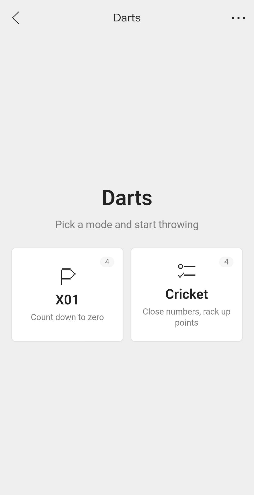
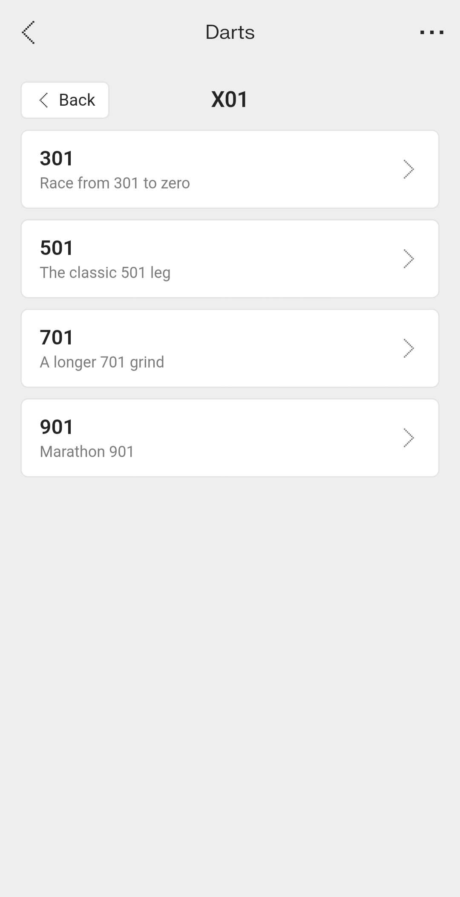
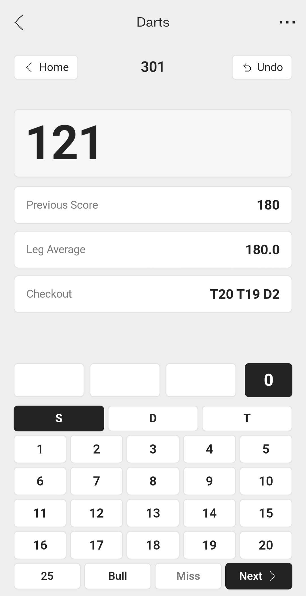

# Darts


A darts scoreboard for **Even Realities G2**, built as an **Even Hub** app. The glasses lens is a heads-up scoreboard you drive with temple gestures — pick a mode, enter each dart, and read your remaining score, last turn, leg average and a suggested checkout without looking away from the board. The companion phone app mirrors the same game with a full keypad. Everything runs on-device; no network, no account.

## Install

Scan with the **Even Realities app** on your phone, or open the listing on Even Hub:

[](https://evenhub.evenrealities.com/landing?package_id=com.darts.g2)

**[evenhub.evenrealities.com → Darts](https://evenhub.evenrealities.com/landing?package_id=com.darts.g2)**

## Features

- **Heads-up scoreboard** - remaining score, last turn, 3-dart leg average and a
  live checkout suggestion, all on the lens.
- **X01** - 301, 501, 701 and 901 for one player, with **double-out**, a single
  leg, automatic bust handling and checkout routes up to 170.
- **Cricket** - Standard, No-Score, Tactics (10-20 + bull) and Random (seven
  random targets), with mark tracking and point scoring.
- **Per-dart entry** - build a turn of up to three darts, review it, then confirm;
  **undo** rolls back dart by dart.
- **Phone ↔ glasses mirroring** - whatever the phone shows, the lens follows;
  temple gestures drive the lens locally.
- **Fully offline** - no proxy, no API key, no permissions.

## Lens screens

1. **Home** - choose a category (X01 or Cricket). Scroll to highlight, tap to open.
2. **Mode list** - the games in that category. Tap one to start.
3. **Game** - enter each dart (multiplier → number), confirm the turn, and read the
   score. The 96px side panel shows the suggested checkout (X01) or the numbers you
   still need to close (Cricket).

## Screenshots

### On the glasses
| Home | Mode list | Checkout |
|---|---|---|
|  |  |  |

### On the phone
| Home | Mode list | Checkout |
|---|---|---|
|  |  |  |

## Architecture

```
        Phone WebView  ──── BLE ────▶  G2 glasses lens
        (keypad scoreboard)            (score entry + side panel)
```

The lens fills the full 576×288 body: a 472px score area on the left and a 96px
side panel on the right for checkouts and open Cricket numbers. All game logic is
pure TypeScript shared by both surfaces — nothing leaves the device.

```
app.json            Even Hub manifest (package id, sdk version, no permissions)
index.html          WebView shell (mounts src/main.ts)
src/
  main.ts           SDK bridge: lens score entry + side panel, and the phone keypad UI
  games.ts          game engine: X01 + Cricket rules, scoring, checkout finder
  games.test.ts     Vitest suite for the scoring and checkout logic
  main.test.ts      phone UI and G2 gesture/bridge integration tests
  i18n.ts           string table (t('key'))
  i18n.test.ts      translation and game-string tests
  style.css         Even OS 2.0 styling
  icons/            Even OS 2.0 icon set (inlined as raw SVG)
images/             glasses + phone screenshots, store QR
PRIVACY.md          privacy policy
RELEASE_NOTES.md    store release notes
CHANGELOG.md        version history
```

## Navigation (temple gestures)

| Gesture     | Home / Mode list   | Score entry             |
|-------------|--------------------|-------------------------|
| Swipe up    | Previous item      | Previous row            |
| Swipe down  | Next item          | Next row                |
| Tap         | Open the selection | Edit a dart / confirm   |
| Double-tap  | Back / exit app    | Back one step / quit    |

Pick a category on the home screen, tap to open it, then tap a mode to start. In a
game, each of the three dart rows opens a multiplier (Single/Double/Triple, Bull,
Miss) and then a number; the last row confirms the turn. Double-tap steps back —
out of dart entry, then to a **Quit game?** prompt, and finally exits the app from
the home screen.

## Setup

```bash
npm install
npm run dev          # Vite dev server on http://localhost:5173
npm run simulate     # G2 simulator (use simulate:auto for the automation API)
```

Sideload to real glasses or build a package:

```bash
npm run qr           # QR code for Even app dev mode
npm run pack         # build + package into darts.ehpk
```

Run the tests:

```bash
npm test             # vitest run (src/**/*.test.ts)
npm run test:coverage # full application coverage, enforced per file
```

Coverage requires **100% statements, branches, functions and lines** for every
application TypeScript file, including the phone UI and G2 bridge in `src/main.ts`.
Only tests and TypeScript declarations are excluded. Open `coverage/index.html`
for the HTML report; CI also uploads the report as an artifact.

The UI tests use jsdom and a mocked Even Hub transport with the SDK's real event
constants and container models. They exercise phone controls, temple gestures,
staged dart entry, checkout panels, startup, rendering order and shutdown. They
do not require glasses and do not validate physical hardware or BLE transport.

## Tech stack

- **@evenrealities/even_hub_sdk** - glasses rendering + gesture events
- **Vite + TypeScript** - build and dev server
- **Vitest + jsdom** - scoring, checkout, phone UI and G2 bridge tests
- **@evenrealities/evenhub-cli** - `qr` / `pack`
- **@evenrealities/evenhub-simulator** - local preview + screenshot automation
- **Even OS 2.0** - design tokens and icon set
